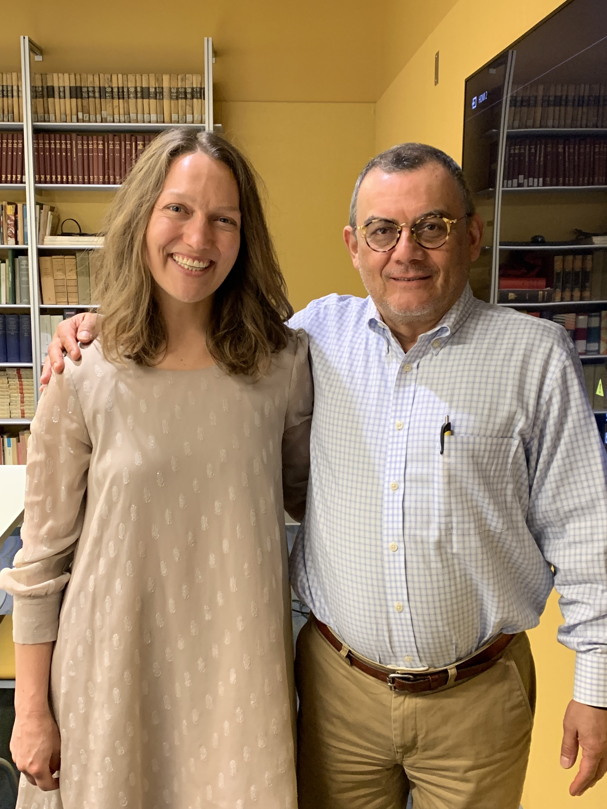

* I specialize in 20th- and 21st-century Mexican and Central American narrative fiction, as well as in broad comparative areas 
that reach into other disciplines and traditions: Latina/o Studies, critical theory, political philosophy, and border and 
diaspora studies. My research is animated by questions of political agency, economic precarity, and the violence that obtains 
throughout waning national modernity, as well as by the ways in which literature shapes, critiques, and indexes burgeoning 
neoliberal globalization.

* My dissertation analyzed the novels of Chilean-Mexican-Catalunyan author Roberto Bolaño and Honduran-Salvadoran-US-Latino 
author Horacio Castellanos Moya as a means of conceptualizing the rise of what I call "post-national literature," which refers 
to literary works that comment on and critique, both formally and thematically, the shifting dynamics of the 
nation state as neoliberal globalization becomes the dominant ordering system of world relations. To do this, I analyzed 
these authors' engagements with literary and aesthetic traditions, particularly realism and the avant-garde, to demonstrate that 
a dialectic emerges between their works and the literary past that opens a space to interrogate the place of 
aesthetic praxis as neoliberal globalization becomes ascendant. Finally, I examined Bolaño’s and Castellanos Moya’s literary rejections 
of Leftist militant reason and discussed how their novels implicate the Left in the rise of neoliberal globalization. 

* My current book project, _Neoliberal Encounters: Latin American Literature in the Age of Technological Globalization_, studies and sets up a series of “neoliberal encounters” in its examination of 21st-century Mexican and Central American literature—produced both domestically and in the diaspora. Encounters are both destructive and generative. They may be sites of confrontation, change, synthesis, or revelation. They are both temporal and spatial, and occur across distinct genres and media. I read narrative works by Roberto Bolaño, Laury Leite, Laia Jufresa, Horacio Castellanos Moya, Claudia Hernández, and Valeria Luiselli as sites of such encounters, and I attend to the ways in which politics, economics, ethics, and aesthetics become entangled in the age of neoliberal globalization. To this end, my project engages with diverse theoretical perspectives, such as Critical Race Theory, Migration and Diaspora Studies, and Sound Studies.

## Peer-Reviewed Publications

* “Broken Bodies, Broken States: Roberto Bolaño on Neoliberal Logic and (Un)Mediated Violence." _Revista de Estudios Hispánicos_ (Accepted, forthcoming March 2021).

* "[Escatología y marginalización en la literatura andina](https://www.academia.edu/43119108/Escatolog%C3%ADa_y_marginalización_en_la_literatura_andina_las_porosas_fronteras_sociopol%C3%ADticas_en_Los_r%C3%ADos_profundos_de_José_Mar%C3%ADa_Arguedas): Las porosas fronteras sociopolíticas en _Los ríos profundos_ de José María Arguedas,” _Revista canadiense de estudios hispánicos_ (May 2020).

* "[Geopoetics, Geopolitics, and Violence](https://www.academia.edu/40263382/Geopoetics_Geopolitics_and_Violence_Un_Mapping_Daniel_Alarcóns_Lost_City_Radio): (Un)Mapping Daniel Alarcón’s _Lost City Radio_” _Latin American Perspectives_ (September 2019).

* "[Carving Place out of Non-Place](https://www.academia.edu/39790659/Carving_Place_out_of_Non-Place_Luis_Rafael_Sánchez_s_La_guagua_aérea_and_Postnational_Space): Luis Rafael Sánchez’s ‘La guagua aérea’ and Post-National Space,” _Chasqui: revista de literatura latinoamericana_ (May 2018).

* "Interventionism, Migration and Diaspora: Central American Literature Beyond the Isthmus,” _Teaching Central American Literature in a Global Context_, MLA Anthology, Eds. Mónica Albizúrez and Gloria E. Chacón, (Forthcoming).

* "La Llorona, from Plaintive to Plaintiff: Accessing Rights in Neoliberal Globalization," _Cry Baby_, eds. Norma Alarcón and Kathleen Alcalá (Under Review, Arizona University Press)

* “The Latin American Telluric Novel and the Mexican Revolution.” _Oxford Handbook of the Latin American Novel_. Proposal accepted, under contract, May 2020. Co-authored with Amanda M. Smith, UC Santa Cruz. Eds. Ignacio López-Calvo and Juan E De Castro.

* "Natalia Almada: [The Sound & the Image](https://muse.jhu.edu/article/633332),” _Chiricú Journal: Latina/o Literatures, Arts, and Cultures_ 1.1 (September 2016), ed. Jonathan Risner: Indiana University Press.

* [Translations](https://www.hiedramagazine.com/conceicao-evaristo) of poetry by Conceição Evaristo (Brazilian Portuguese to English), _Revista Hiedra_ 1.1 (Fall 2013): 66-68.

## Book Reviews
* [Review](https://muse.jhu.edu/article/697754) of _Chicana/o Remix: Art and Errata Since the Sixties_ by Karen Mary Davalos. _Chiricú Journal: Latina/o Literatures, Arts, and Cultures_ 2.2 (May 2018).

* [Review](https://muse.jhu.edu/article/679167) of _Pliegues del yo: Cuatro estudios sobre escritura autobiográfica en Hispanoamérica_ by Sergio R. Franco. _Revista de Estudios Hispánicos_ 51.3 (October 2017).

## Articles in Preparation
* “Rancière and the Paradox of Politics: Mexico, Central America, and the Long 1968 in Retrospect.”
* "Desnudando a los maîtres à penser: La 'novelization' de lo histórico en _El fin de la locura_."
* “Dead Matter: A Historical Materialist Approach to Literary Corpses in W.G. Sebald and Oscar Zeta Acosta.”
* “A Tale of Two Genres: The Duæling Discourses of Luis Rafael Sánchez’s _Quíntuples_.”
* “Violencia y alienación social en El Salvador: _El arma en el hombre_ como Bildungsroman neoliberal.”

In April 2019, I had the pleasure of participating in a workshop and spending the day with Honduran-Salvadoran author Horacio Castellanos Moya, one of two authors whose corpora I examine at length in my dissertation project.
