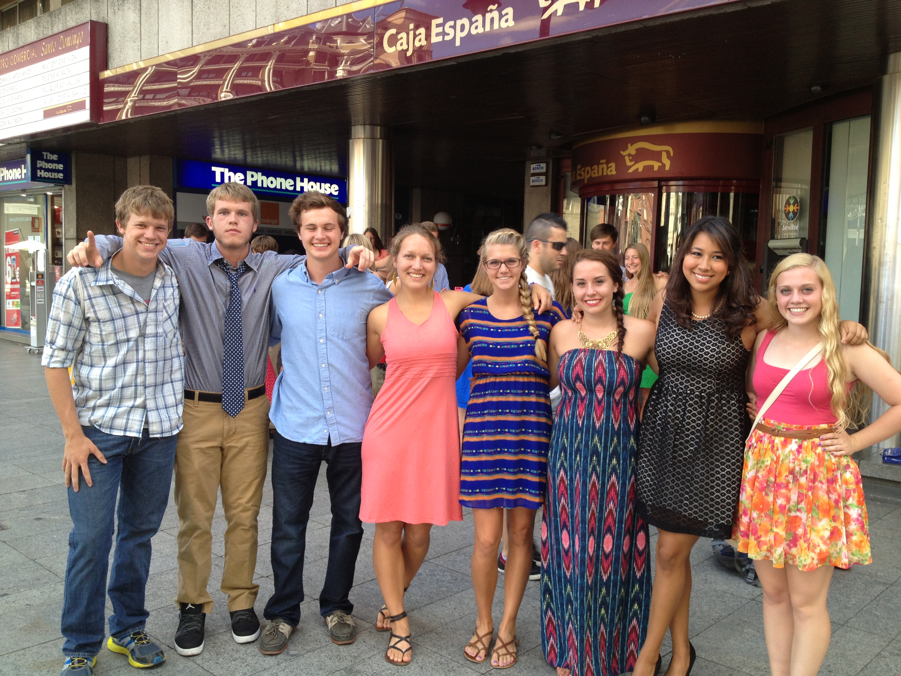

## Vision for Teaching

As a teacher of literature, and specifically Latin American literature, I have the unique responsibility to not only impart material, 
but to introduce students to voices and cultures that are often not their own. To undertake this task, I approach my teaching with four 
principle objectives: (1) to help my students develop close reading skills that will make them more attentive and curious readers of 
literature; (2) to hone their ability to write effectively and articulate complex ideas in English and Spanish; (3) to arm them with 
hermeneutic tools that will facilitate a deeper understanding of texts and cultures; and (4) to foster a relationship with literary 
works that, in addition to leaving space for enjoyment of literature, cultivates an appreciation of the ways in which aesthetics and 
literary form and content enable new means of understanding and engaging with the world.

## University Teaching

### University of British Columbia, Department of French, Hispanic and Italian Studies (2019-Present)
* SPAN 550: Porn Lit: Critical Approaches to Erotic Literature in Latin America and Spain
* SPAN 490: Assassination, Disappearance, Impunity: Latin American Detective Fiction and the Nation State
* SPAN 365: Modern Magics: Spanish-American Literature and Culture since the 1820s
* LAST 303: Indigenous Peoples, Globalization, and Labour in Latin America (visit the [course blog](https://blogs.ubc.ca/indigenouslabour/) to learn about podcasting as a learning outcome and to listen to student podcast episodes.)
* LAST 303: Latin American [Indigenous Foodways](https://blogs.ubc.ca/course0935bb2c1345dfa4e91d0701421d97f5c03a0045/)

### Indiana University Bloomington, Department of Spanish and Portuguese, Latino Studies Program (2012-2018)
* HISP 280: Advanced Spanish Grammar & Composition in Literary Context
* LATS 103: Introduction to Latino Cultures & Literatures
* HISP 250: Basic Language IV 
* HISP 105: Accelerated Basic Language I 

### Clemson University, Department of Languages (2010-2012)
* SPAN 102: Accelerated Basic Language I
* SPAN 201: Basic Language III 
* SPAN 202: Basic Language IV 

### University of Santiago de Compostela, Department of English Philology, Galicia, Spain (2009-2010)
* English Philology I: Pre-intermediate Language, Literature and Culture
* English Philology II: Intermediate Language, Literature and Culture
* English Philology IV: Advanced Literature and Translation 

### University of Kansas, Department of Spanish and Portuguese (2007-2009)
* SPAN 111: Accelerated Basic Spanish

## Study Abroad Coordination and Teaching
### Indiana University Honors Program in Foreign Languages, León, Spain (Summer 2013)
* Hispanic Literatures I, II, III

### Clemson University Study Abroad Director, Quito, Ecuador (Summer 2012)
* SPAN 398: Ecuadorian Literature and History 
* International Studies 210: Ecuadorian Culture in Context

### University of Kansas Summer Immersion Program, Barcelona, Spain (Summer 2009)
* SPAN 270: Literature, Culture and History of Spain

_Directing studies abroad and language immersion programs provides the unique opportunity to experience culture and get to know students outside of the traditional classroom setting. Top image: The cast of **Se vende una mula** just prior to performing at the end of program reception and talent showcase in León, Spain (Summer 2014). Bottom image: The 2012 Clemson Language Immersion Program took students to Atlanta to meet Latin American players and coaches on the Braves._
